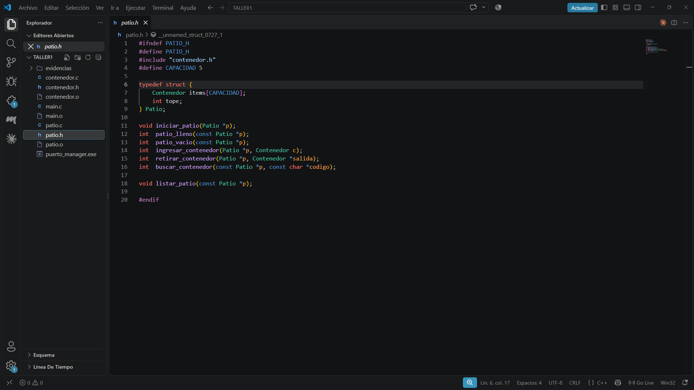
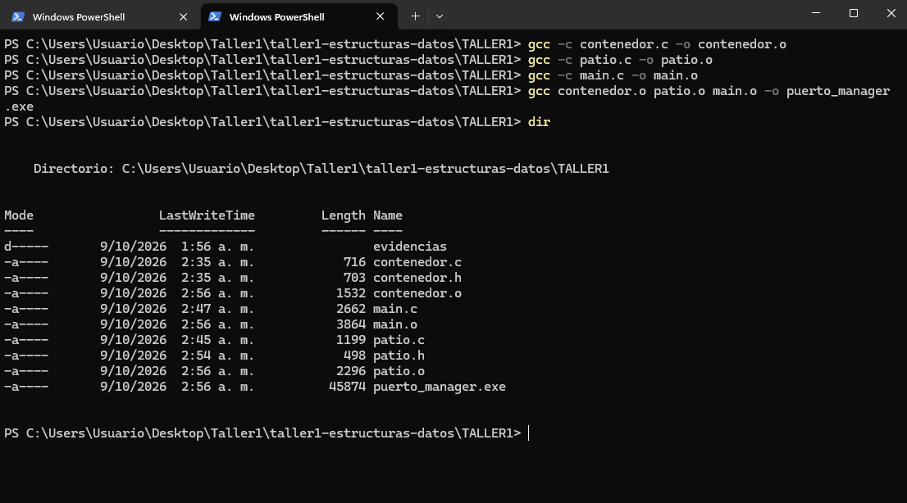
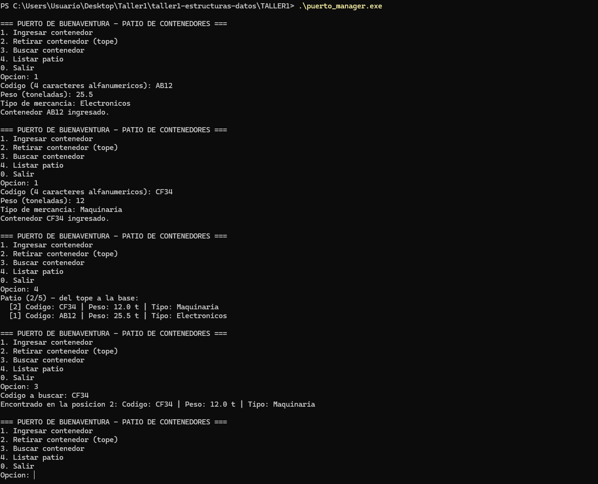

#  Taller 1: Programación Modular en C

### Sistema de control del patio de contenedores del puerto de Buenaventura


-orange)


| | |
| --- | --- |
| **Asignatura** | Estructuras de Datos |
| **Programa** | Ingeniería de Sistemas, Universidad del Pacífico |
| **Docente** | Ing. Gonzalo Andrés Lucio López |
| **Estudiante** | Ana Rios |
| **Modalidad** | Individual |
| **Fecha** | 9 de octubre de 2026 |

---

## 📌 Descripción del problema

Ante el aumento del flujo de carga en el puerto de Buenaventura, se necesita un módulo ligero en C que gestione el patio de almacenamiento temporal y la asignación rápida de contenedores en las bahías de despacho.

El programa es interactivo por consola y permite:

- Registrar un contenedor con su **código único** (4 caracteres alfanuméricos), su **peso en toneladas** y su **tipo de mercancía**.
- Almacenar hasta **5 contenedores activos** en la zona de despacho rápido.
- **Retirar**, **buscar** y **listar** los contenedores del patio.

## 💡 Decisión de diseño: una pila (LIFO)

El patio se modela como una **pila**: el último contenedor que entra es el primero que sale. Es lo más natural en un patio, porque los contenedores se apilan y para sacar el de abajo habría que mover los de encima.

Cuando el patio ya tiene 5 contenedores, el sistema **bloquea el ingreso** y avisa al usuario hasta que se retire uno.

##  Estructura del repositorio

```
taller1-estructuras-datos/
├── README.md
└── TALLER1/
    ├── contenedor.h
    ├── contenedor.c
    ├── patio.h
    ├── patio.c
    ├── main.c
    └── evidencias/
        ├── 1_codigo.png
        ├── 2_compilacion.png
        └── 3_ejecucion.png
```

##  Módulos

Cada módulo tiene un archivo `.h` (qué ofrece: estructuras y prototipos) y un `.c` (cómo lo hace). Todos los `.h` usan guardas de inclusión (`#ifndef`, `#define`, `#endif`).

| Módulo | Responsabilidad |
| --- | --- |
| `contenedor.h` / `contenedor.c` | Define la estructura `Contenedor` (código, peso y tipo) y valida que el código tenga 4 caracteres alfanuméricos. |
| `patio.h` / `patio.c` | Implementa la pila: capacidad, ingreso, retiro, búsqueda y listado. |
| `main.c` | Menú interactivo que une los dos módulos. Solo pide datos y llama a las funciones. |

La dependencia va en un solo sentido: `main.c` usa `patio.h`, y `patio.h` usa `contenedor.h`.

### Funciones principales

| Función | Qué hace |
| --- | --- |
| `validar_codigo` | Retorna 1 si el código tiene exactamente 4 caracteres alfanuméricos. |
| `crear_contenedor` | Construye un contenedor con los datos recibidos. |
| `iniciar_patio` | Deja el patio vacío (`tope = 0`). |
| `ingresar_contenedor` | Guarda en `items[tope]` y sube `tope`. Retorna 1 si ingresó, 0 si está lleno y -1 si el código ya existe. |
| `retirar_contenedor` | Baja `tope` y entrega el contenedor del tope (LIFO). |
| `buscar_contenedor` | Recorre el patio y retorna la posición del código, o -1 si no está. |
| `listar_patio` | Muestra los contenedores del tope a la base. |

##  Compilación y ejecución

Requiere **GCC** (en Windows, MinGW-w64 con MSYS2). Cada archivo se compila por separado a un archivo objeto (`.o`) y luego se enlazan en el ejecutable final. Desde la carpeta `TALLER1`:

```
gcc -c contenedor.c -o contenedor.o
gcc -c patio.c -o patio.o
gcc -c main.c -o main.o
gcc contenedor.o patio.o main.o -o puerto_manager.exe
```

Para ejecutar el programa:

| Terminal | Comando |
| --- | --- |
| CMD | `puerto_manager.exe` |
| PowerShell | `.\puerto_manager.exe` |

##  Ejemplo de ejecución

Después de ingresar los contenedores `AB12`, `CD34`, `EF56`, `GH78` e `IJ90`, el listado muestra el patio lleno, del tope a la base:

```
Patio (5/5) - del tope a la base:
  [5] Codigo: IJ90 | Peso: 20.0 t | Tipo: Banano
  [4] Codigo: GH78 | Peso: 12.0 t | Tipo: Textiles
  [3] Codigo: EF56 | Peso: 30.2 t | Tipo: Maquinaria
  [2] Codigo: CD34 | Peso: 18.0 t | Tipo: Cafe
  [1] Codigo: AB12 | Peso: 25.5 t | Tipo: Electronicos
```

Casos que maneja el programa:

| Acción | Resultado |
| --- | --- |
| Ingresar un sexto contenedor | `BLOQUEO: el patio esta lleno (5/5). Retire un contenedor primero.` |
| Retirar un contenedor | Sale el último que entró (`IJ90`). |
| Buscar `EF56` | `Encontrado en la posicion 3` |
| Buscar un código que no existe | `No se encontro el contenedor ZZZZ.` |
| Ingresar un código repetido | `Ya existe un contenedor con el codigo AB12.` |
| Ingresar un código inválido | `Codigo invalido.` |

## 📸 Evidencias

### 1. Código

Estructura de archivos en el editor y uso de los prototipos en los archivos `.h`.



### 2. Compilación

Compilación con GCC, módulo por módulo y enlace final, sin errores.



### 3. Ejecución

Programa en ejecución: ingreso de contenedores y listado actualizado del patio.



##  Control de versiones

El historial de commits sigue el avance modular del taller:

| Commit | Contenido |
| --- | --- |
| `Agrega modulo contenedor` | `contenedor.h` y `contenedor.c` |
| `Agrega modulo patio (pila de capacidad 5)` | `patio.h` y `patio.c` |
| `Agrega main con menu interactivo` | `main.c` |
| `Agrega evidencias` | Las 3 capturas en `TALLER1/evidencias` |

##  Conceptos aplicados

- **Modularidad:** separación de responsabilidades entre archivos `.h` y `.c`.
- **Guardas de inclusión:** evitan que un `.h` se incluya dos veces y se redefinan las estructuras.
- **Compilación separada:** cada `.c` genera un archivo objeto `.o`, y el enlazado los une en el ejecutable. Si cambia un archivo, solo se recompila ese.
- **Pila (LIFO):** arreglo de tamaño fijo y un índice `tope` que cuenta los elementos.
- **Paso por puntero:** las funciones del patio reciben `Patio *p` para modificar el patio original y no una copia.

---

Hecho por **TU NOMBRE** para la asignatura de Estructuras de Datos.
